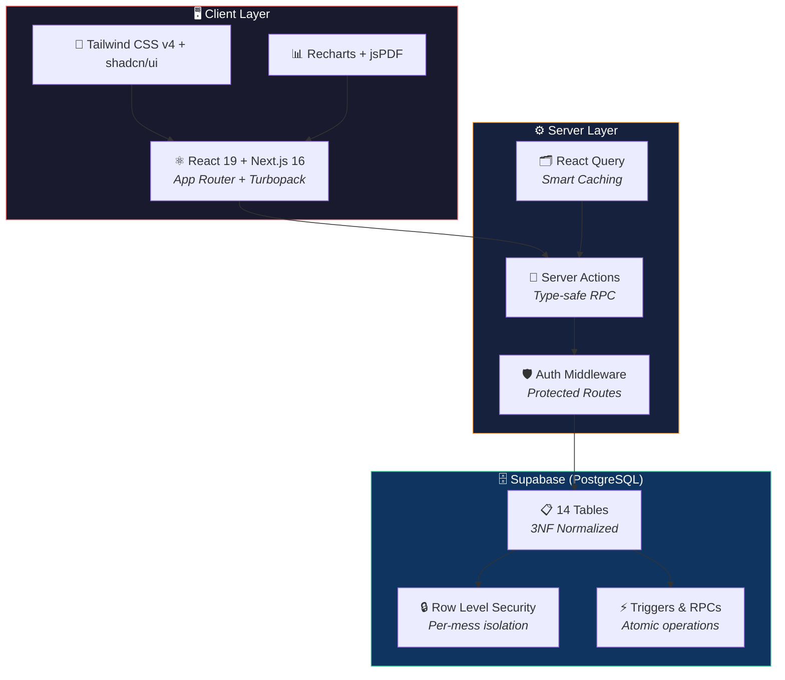
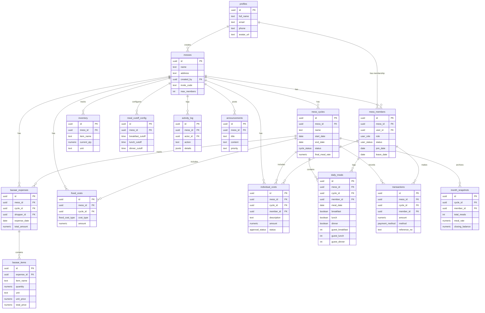
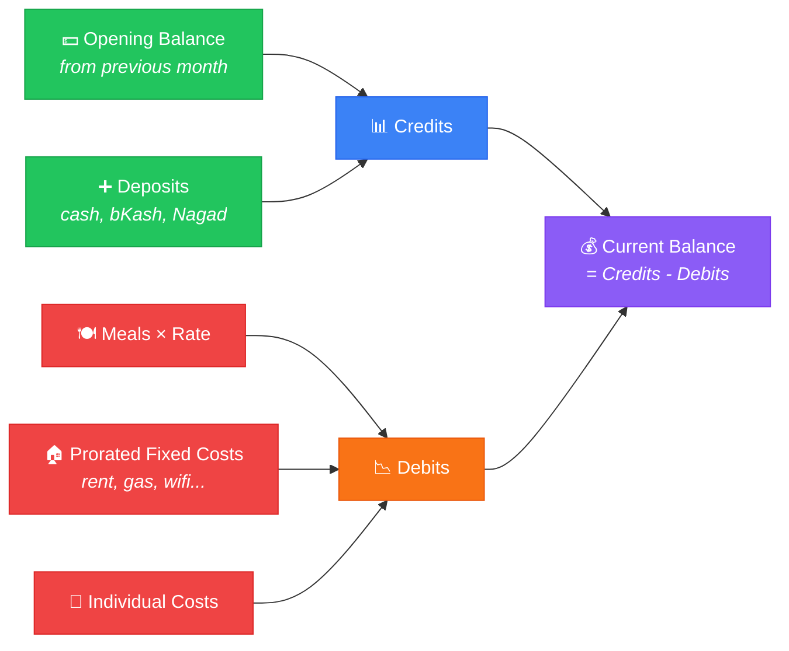
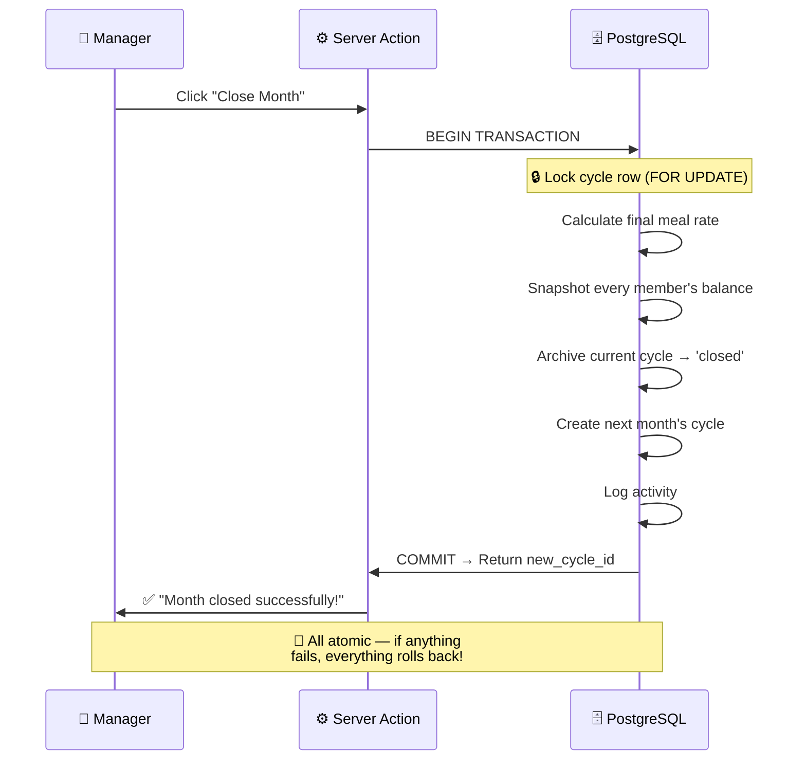
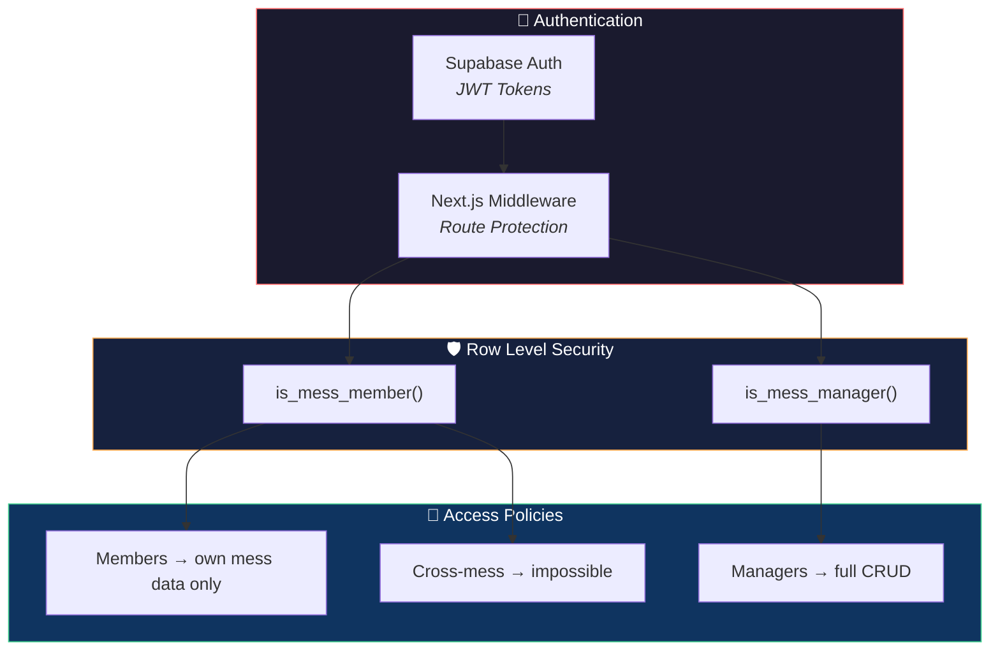

<div align="center">

<!-- Animated Header -->


<!-- Typing SVG -->
<a href="https://kangal.software">
  
</a>

<br/>

<!-- Badges -->
[](https://kangal.software)
[](https://nextjs.org)
[](https://supabase.com)
[](https://typescriptlang.org)
[](https://tailwindcss.com)
[](https://react.dev)

<br/>

<!-- GitHub Stats Badges -->


</div>

---

## 💡 The Problem

> Every university mess in Bangladesh runs on **WhatsApp groups**, **paper khatas**, and **mental math**. Managers get accused of stealing money, members forget which meals they ate, and month-end calculations take hours with a calculator.

<div align="center">

```
     📱 WhatsApp Groups          📓 Paper Khatas           🧮 Mental Math
     ─────────────────          ──────────────           ──────────────
     "ভাই আজকে খাবো না"        *হারিয়ে গেছে*            "মনে নাই ভাই"
     "কে বাজার করবে?"           *ভুল হিসাব*              "তোমার ৫০ টাকা বাকি"
     "ম্যানেজার টাকা মারছে!"    *ছেঁড়া পেজ*             "আমি ২ বেলাই খাইনি!"
```

</div>

### ✅ KANGAL fixes all of this. Permanently.

---

## ✨ Features at a Glance

<div align="center">

| | Feature | What it does | Vibe |
|---|---------|-------------|------|
| 🍽️ | **Meal Tracking** | Toggle breakfast/lunch/dinner with one tap | *"আজকে লাঞ্চ অফ"* |
| 🛒 | **Bazaar Logs** | Record every shopping trip item-by-item | *"আজ পেঁয়াজ ১ কেজি, ৪০ টাকা"* |
| 📊 | **Auto Meal Rate** | `Total Bazaar ÷ Total Meals = Rate` — live | *"আজকের রেট ৩৮.৫০"* |
| 💰 | **Deposits** | Track every taka deposited, with approval | *"১৫০০ বিকাশে দিলাম"* |
| 📄 | **PDF Reports** | One-click export for any member or full mess | *"এই নাও PDF"* |
| 📈 | **Spending Charts** | Visualize who ate how much with bar charts | *"সবচেয়ে বেশি তুমি খাও ভাই"* |
| 👥 | **Manager Tools** | Month closing, member management, role transfer | *"নতুন ম্যানেজার নিযুক্ত"* |
| ⏰ | **Cutoff Locking** | Auto-lock meals after configurable cutoff times | *"রাত ৯টার পর বন্ধ"* |
| 🔐 | **Full Auth** | Email/password + Google OAuth + password reset | *"ভুলে গেছি? Reset!"* |
| 📱 | **PWA Ready** | Install on home screen, works like native app | *"অ্যাপ এর মতোই!"* |

</div>

---

## 🏗️ System Architecture



---

## 🗄️ Database Schema

<details>
<summary><b>📐 Click to expand Entity Relationship Diagram</b></summary>

<br/>



</details>

---

## 💸 The Balance Formula



```
Balance = (Opening + Deposits) − (Meals × Rate + Fixed Costs + Individual Costs)
```

---

## ⚡ Month Close Flow



---

## 🛠️ Tech Stack

<div align="center">

| Layer | Technology | Why |
|-------|-----------|-----|
| ⚛️ **Frontend** | Next.js 16 + React 19 | App Router, Server Actions, Turbopack |
| 🎨 **Styling** | Tailwind CSS v4 + shadcn/ui | Beautiful, consistent, accessible |
| 🗄️ **Database** | Supabase (PostgreSQL) | RLS, Triggers, RPCs, Realtime |
| 🔐 **Auth** | Supabase Auth | Email/Password + Google OAuth |
| 📊 **Charts** | Recharts | Interactive, responsive visualizations |
| 📄 **PDF** | jsPDF + AutoTable | Generate reports client-side |
| 📦 **State** | React Query (TanStack) | Smart caching, auto-refetch |
| ✅ **Validation** | Zod | Runtime type safety |
| 🚀 **Deploy** | Vercel | Zero-config, edge-optimized |
| 📱 **PWA** | Web Manifest | Installable, native-like |

</div>

---

## 📁 Project Structure

```
kangal-app/
├── 🌐 public/
│   ├── manifest.json              # PWA configuration
│   └── icons/                     # App icons (192×192, 512×512)
│
├── 📦 src/
│   ├── 🗂️ app/
│   │   ├── (auth)/                # 🔑 Login, Signup, Forgot Password
│   │   ├── auth/callback/         # 🔄 OAuth callback handler
│   │   ├── dashboard/             # 📊 Main app
│   │   │   ├── page.tsx           # 🏠 Dashboard overview
│   │   │   ├── meals/             # 🍽️ Meal toggles + chart + manage
│   │   │   ├── bazaar/            # 🛒 Bazaar expense logs
│   │   │   ├── deposits/          # 💰 Deposit management
│   │   │   ├── options/           # ⚙️ Cycle & mess settings
│   │   │   ├── settings/          # 👤 User profile settings
│   │   │   └── admin/             # 👑 Manager-only
│   │   │       ├── costs/         # 💸 Fixed & individual costs
│   │   │       ├── members/       # 👥 Member management
│   │   │       └── month-close/   # 📋 Monthly settlement
│   │   └── page.tsx               # 🏠 Landing page (marketing)
│   │
│   ├── 🧩 components/
│   │   ├── dashboard/             # Stats cards, charts, meal toggles
│   │   ├── landing/               # Animated hero, feature cards
│   │   ├── mess-context.tsx       # 🔗 Shared context (perf optimization)
│   │   └── ui/                    # shadcn/ui primitives
│   │
│   ├── 📚 lib/
│   │   ├── actions/               # Server actions (meals, bazaar, finance)
│   │   ├── supabase/              # Client & middleware setup
│   │   ├── pdf-export.ts          # PDF generation logic
│   │   └── validations.ts         # Zod schemas
│   │
│   └── 📝 types/                  # TypeScript type definitions
│
└── 🗄️ supabase/
    ├── schema.sql                 # Complete DB schema (14 tables, RLS, triggers)
    ├── migration_fixes.sql        # Post-deploy fixes
    └── migration_approval_system.sql  # Approval workflow
```

---

## 🔒 Security Model



- **Every table** has RLS enabled — no data leaks between messes
- **Server-side auth** via Supabase SSR middleware
- **No secrets in client** — all sensitive operations are Server Actions
- **Atomic transactions** — month closing uses `SECURITY DEFINER` RPCs

---

## 🚀 Getting Started

### Prerequisites

- **Node.js 18+** and **npm**
- A [Supabase](https://supabase.com) project (free tier works!)

### Quick Setup

```bash
# 1️⃣ Clone the repo
git clone https://github.com/sovon1/kangal-app.git
cd kangal-app

# 2️⃣ Install dependencies
npm install

# 3️⃣ Set up environment variables
cp .env.local.example .env.local
# Edit .env.local with your Supabase URL and anon key

# 4️⃣ Set up the database
# Copy supabase/schema.sql → Supabase SQL Editor → Run

# 5️⃣ Start the dev server
npm run dev
```

Open **[http://localhost:3000](http://localhost:3000)** and you're live! 🎉

### Environment Variables

| Variable | Description |
|----------|-------------|
| `NEXT_PUBLIC_SUPABASE_URL` | Your Supabase project URL |
| `NEXT_PUBLIC_SUPABASE_ANON_KEY` | Your Supabase anonymous key |

---

## 📱 Install as App (PWA)

<div align="center">

```
📱 Open kangal.software on your phone
     ↓
📥 Tap "Add to Home Screen"
     ↓
🚀 Done! Works like a native app!
```

</div>

---

## 🧮 Database Stored Procedures

| Function | Purpose |
|----------|---------|
| `calculate_meal_rate(cycle_id)` | `Σ Bazaar ÷ Σ Meals` — the core formula |
| `prorate_fixed_costs(member_id, cycle_id)` | Fair share based on days present |
| `calculate_member_balance(member_id, cycle_id)` | Full financial breakdown |
| `close_mess_month(cycle_id)` | Atomic month close (snapshot → archive → new cycle) |
| `enforce_meal_cutoff()` | Trigger: blocks meal changes after cutoff (managers bypass) |
| `deduct_inventory_on_bazaar()` | Auto-updates inventory on bazaar entry |
| `update_bazaar_total()` | Auto-recalculates expense totals |

---

## 📊 Enum Types

```sql
user_role         → 'manager' | 'member' | 'cook'
user_status       → 'active' | 'inactive' | 'on_leave'
payment_method    → 'cash' | 'bkash' | 'nagad' | 'bank_transfer' | 'other'
approval_status   → 'pending' | 'approved' | 'rejected'
cycle_status      → 'open' | 'closed' | 'archived'
fixed_cost_type   → 'cook_salary' | 'wifi' | 'gas' | 'electricity' | 'water' | 'rent' | ...
```

---

## 🤝 Contributing

Contributions are welcome! Feel free to:

1. 🍴 Fork the repo
2. 🌿 Create a branch (`git checkout -b feature/amazing-feature`)
3. 💾 Commit changes (`git commit -m 'Add amazing feature'`)
4. 📤 Push (`git push origin feature/amazing-feature`)
5. 🔃 Open a Pull Request

---

## 📝 License

This project is open source under the **[MIT License](LICENSE)**.

---

<div align="center">


**Built with ❤️ for mess-er ভাইরা everywhere.**

*"ম্যানেজার তুমি টাকা মারছো — এই কথা শুনতে হবে না আর।"* 🐕

<br/>

<a href="https://kangal.software">
  
</a>

</div>
